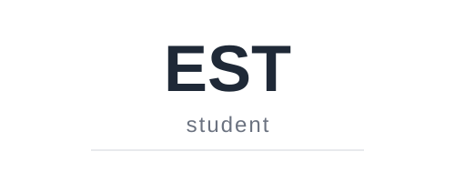

  

### 🚀 About Me

- 🧑‍🎓 Currently studying and exploring the IT world  
- 💻 Passionate about app development and building creative projects
- 🎵 Building cool applications like **Hyprset** and **SongGuesser**
- 📖 Always eager to learn new technologies and concepts
- 🏫 [My School GitHub](https://github.com/HJakobTL)

---

### 🛠️ Skills & Technologies

- **Languages:** Python, Java, Kotlin, SQL
- **App Development:** Full-stack development, UI/UX design
- **Web:** HTML, CSS
- **Tools:** Android Studio, JetBrains IntelliJ, Git, VS Code

---

### 📱 Featured Projects

- **Hyprset** - A customizable settings/configuration app
- **SongGuesser** - A music guessing game application
- [Explore my repositories](https://github.com/EST2374?tab=repositories) for more projects

---

### 📫 Contact

- 📧 [jack.cez2004@gmail.com](mailto:jack.cez2004@gmail.com)
- 💼 [LinkedIn: Jakob Cezawa](https://www.linkedin.com/in/jakob-cezawa-03b69535b/)

---

<!--
**EST2374/EST2374** is a ✨ special ✨ repository because its README.md (this file) appears on your GitHub profile.
-->
